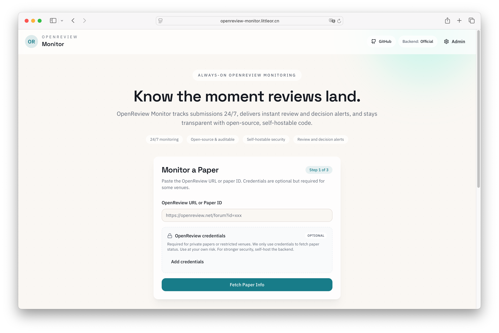
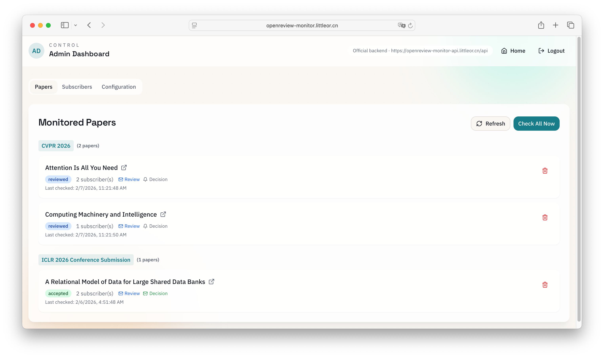

# OpenReview Monitor

[中文说明](README_zh.md)

Privacy-first, self-hostable OpenReview monitor: email alerts for new reviews, reviewer score changes, and decisions.

OpenReview Monitor watches specific OpenReview papers and emails you when new reviews are posted, ratings/scores change, or decisions are announced.

## Demo
- Frontend: [openreview-monitor.vercel.app](https://openreview-monitor.vercel.app)
- Backend API: [openreview-monitor-api.littleor.cn](https://openreview-monitor-api.littleor.cn/)

## Screenshots

  
  

## Features
- Track papers by URL or ID.
- Email notifications for new reviews, review edits (e.g., rating/score changes), and decisions.
- Admin panel (`/admin`) for managing papers/subscribers and triggering a manual check.
- Self-hostable backend: FastAPI + SQLite + SMTP (keep OpenReview credentials private; no public server required).
- Frontend can switch between the hosted backend and your own backend.

## How It Works
- The backend checks OpenReview on a schedule (`CHECK_INTERVAL`).
- Latest state is persisted in SQLite; notifications are delivered via your SMTP provider.
- It can also notify when a reviewer updates their review (e.g., rating/score changes).
- The frontend is a thin client that can talk to the hosted backend or your self-hosted backend.

## Quick Start (Hosted UI)
1. Open the frontend.
2. Paste an OpenReview paper URL or ID.
3. Enter your email address.
4. Optional: provide OpenReview credentials (some venues require login).
5. Submit and wait for email updates.

Tip: enable `Notify me when reviews are modified` to get alerts when a reviewer changes their rating/score.

## Self-host Backend (No Public Server Required)
You can run the backend on your own machine or private network. A public server is not required.

1. `cd backend`
2. `cp .env.example .env` and set `SMTP_*`, `FROM_EMAIL`, `ADMIN_PASSWORD` (and `SECRET_KEY` for production).
3. `uv sync`
4. `uv run uvicorn app.main:app --host 0.0.0.0 --port 8000`
5. In the frontend, open `Backend Settings`, choose `Custom`, and set the base URL to `http://localhost:8000` (the UI auto-appends `/api`).

Notes:
- If you plan to enter OpenReview credentials, self-hosting the backend is strongly recommended.
- If you use the hosted frontend, add `https://openreview-monitor.vercel.app` to `CORS_ALLOW_ORIGINS` in `backend/.env`.
- Want to run the backend on another machine (LAN/public)? Use HTTPS and see the deployment doc.

## Email Deliverability
Please add `no_reply@littleor.cn` to your email whitelist to avoid missing notifications.

## Documentation
- Backend deployment: `docs/backend_deploy.md`
- Development: `docs/development.md`

## Contributing
Issues and pull requests are welcome. For local setup, see `docs/development.md`.

## License
MIT.

## Disclaimer
This project is not affiliated with OpenReview.

## Wish
May you all get accepted papers and great reviews.
